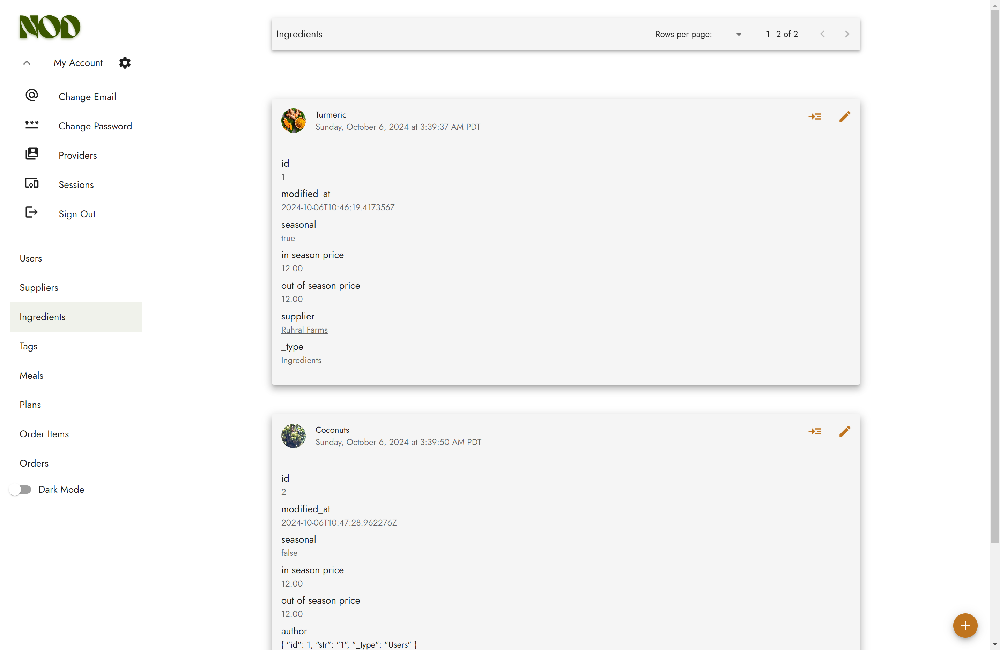

# Object-Actions Worksheet

## PURPOSE

- [x] Learn Relational Database Schema Design
- [x] Quickly build idea App & API prototypes
- [x] Scaffold Content Management Systems
- [x] Scaffold Authentication and Access Permissions
- [x] Scaffold Web App interface and API connectivity
- [x] Complete End-To-End tests for functionality and content permissions
- [x] Generate unlimited fake data to test and prototype, and the base data for your Cypress tests 

## HOW
- [A] Defined your project's content Objects and the Actions to interact with them
- [B] Define the fields for each Object type
- [C] Define the roles and permissions for each Action per Object

|                 A: Objects to Actions                 |             B: Object Field Types              |                                                               C: Permissions Matrix                                                                |
|:--------------------------------------------------:|:-------------------------------------------:|:-----------------------------------------------------------------------------------------------------------------------------------------------:|
|  |   |  |
| ↓ | ↓ generates ↓ | ↓ |

A secure API and CMS written in Django, a fully integrated and authenticating ReactJS front-end, and testing suites with Cypress.io and K6:

https://github.com/user-attachments/assets/3065f1a1-9fa6-4420-99c2-f3aa4bcce373

|                                                         Content Admin                                                          |                                                           API Documentation                                                           |                                                with Secure Authentication System                                                |
|:------------------------------------------------------------------------------------------------------------------------------:|:-------------------------------------------------------------------------------------------------------------------------------------:|:-------------------------------------------------------------------------------------------------------------------------------:|
|  |  |  |

# TO USE:

### Install Git, Brew, Python3, NVM, Node  
### `sh install.sh`
This will only install these tools if they don't exist. You can skip this if you have these dependencies.

### Build Your Stack
### `sh setup.sh [project name] [object actions path].csv`
 
This will clone the entire [stack](stack) directory and change necessary names and variables to your project name.

### Install / Connect to MySQL  
Update your database credentials here [newproject/django/.env](/stack/django/.env#L16)
 
If you don't have a mysql server, run `sh mysql_db.sh` to install docker and mysql inside a container and leave the .env file with it's default values.

### Run your Web App, API, CMS, and Cypress tests 
### `sh start.sh newproject`

This will start these sites:
- Django API: https://localapi.newproject.com:8080/api/schema/swagger
- Django Admin: https://localapi.newproject.com:8080/admin/login
- React WebApp: https://localhost.newproject.com:3000

### Generate unlimited Fake Data 
`sh fakedata.sh newproject`
By default 5 of each object type will be created. You can change the numbers and control which users create content from [newproject/databuilder/src/WorldBuilder.ts#L168](stack/databuilder/src/WorldBuilder.ts#L168)

### Test your WebApp with Cypress.io
`sh test-frontend.sh newproject`
By default 5 of each object type will be created. You can change the numbers and control which users create content from [newproject/databuilder/src/WorldBuilder.ts#L168](stack/databuilder/src/WorldBuilder.ts#L168)

### Test your API with K6
`sh test-backend.sh newproject`
By default the load testing runs for 30 seconds. You can change the settings here [newproject/k6/localhost.js](stack/k6/localhost.js#L4)

---

#### If you already have a codebase or only want to generate TypeScript or Django code visit [USAGE.md](USAGE.md) to generate individual files 

# TO CUSTOMIZE:

1. Copy and start your own from this [Empty version](https://docs.google.com/spreadsheets/d/14Ej7lu4g3i85BWJdHbi4JK2jM2xS5uDSgfzm3rIhx4o/edit?usp=sharing). Or copy and edit this [Example version](https://docs.google.com/spreadsheets/d/1AkFY0dSelMAxoaLVA_knNHIYmL97rtVjE1zuqEonCyM/edit?usp=sharing) for a meal prep program:
2. Down the CSV and re-run `sh setup.sh [project name] [object actions path].csv`

--------------------------------------------------------------------------------

### TO CONTRIBUTE: [CONTRIBUTING.md](CONTRIBUTING.md)

### TO SPONSOR: [github.com/sponsors/eliataylor](https://github.com/sponsors/eliataylor)
